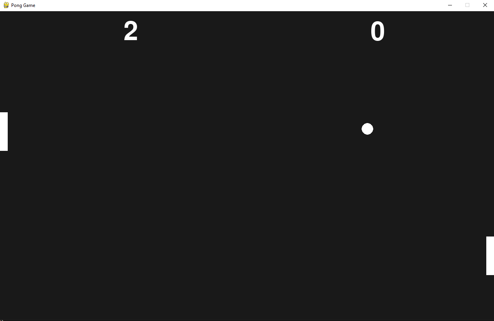

# Pong Game in Pygame

Another simple project I worked on to refresh foundational Python skills by making the classic Pong game!

I used the pygame library, which I first discovered a couple of years ago when I remade the original 1981 Donkey Kong game to practice OOP.

This was a small, nostalgic nod to that experience, and it was a lot of fun, so I might play around with the library some more to create more complex games!

